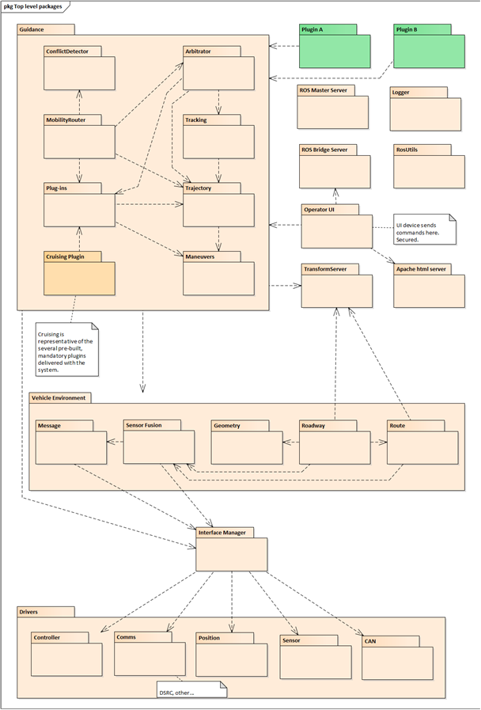

**Connected Automated Research for Mobility Applications (CARMA)**, CARMA is a reusable, extensible platform for controlling SAE level 1 connected, automated vehicles (CAVs). It provides a rich, generic API for third party plugins that implement vehicle guidance algorithms. It is written in Java and C++ and runs in a Robot Operating System (ROS) environment. It offers a rich application programming interface (API) for third party authors to develop guidance plugins that can plan vehicle trajectories under certain conditions. The platform can be reused as-is on a variety of properly modified vehicles, with only a need for new device drivers to connect to the vehicle hardware.

## What Is CARMA

Managing automated vehicle motion involves three aspects. The first is **navigation**, which is the act of determining where the vehicle currently is with respect to the earth and with respect to the desired path of travel (its planned route). The second is **guidance**, which includes the processes of determining how the vehicle is to move from its current location to its destination. The destination and route will be handed to the guidance algorithms, and they then determine how the vehicle’s motion needs to be adjusted at any time in order to follow the route. The third aspect of **automated vehicle motion is control**, which covers the actuation of the vehicle’s physical devices to induce changes in motion (for land vehicles these are typically causing the wheels to rotate faster or slower and turning the steering wheel). Therefore, the navigation solution becomes an input to the guidance function, and the guidance solution becomes an input to the control function. As the vehicle moves, obviously its location changes so that the navigation function constantly needs to update its solution and the cycle iterates as quickly as necessary to produce a smooth and accurate vehicle motion. The rate of iteration is largely determined by the expected speed of the vehicle.

## Documentation

### System Specifications
to be added.

### Release Notes
The current version release of the CARMA software platform. [CARMA Release Notes](<docs/Release_notes.md>)

### Architecture & Design
The architecture described here is vehicle-centric.  That is, it addresses the construction of a CAV Platform, of which there may be several copies built, that is to be installed in a single Saxton Lab research vehicle.  There are several components in this platform that need to communicate with each other; much of this inter-component communication will use the Robot Operating System (ROS) framework, but ROS communications are restricted to the network within a single vehicle.  The platform will also enable communications between vehicles (V2V) or between the host vehicle and various roadside infrastructure components (V2I) using other communication protocols, such as DSRC messaging. [CAV Platform Architecture Document](https://usdot-carma.atlassian.net/wiki/spaces/CAR/pages/23330913/CARMA+Project+Documentation?preview=/23330913/24838181/CAV%20Platform%20Architecture.docx) 

### Users Guide
This guide describes the PC configuration steps necessary to install and run the CARMA platform. The steps match what the development team performed on their own PCs and some configuration may be different for other users. [CARMA User Guide](https://usdot-carma.atlassian.net/wiki/spaces/CAR/pages/23330913/CARMA+Project+Documentation?preview=/23330913/24805504/CARMA%20User%20Guide.docx) 

### Developers Guide

### Getting Started
The following instructions describe the procedure to fetch, build, and run the application. 

### Prerequisites

#### Build
to be added.

#### Deployment
to be added.

#### Testing
to be added.

#### Contribution
Welcome to the CARMA contributing guide. Please read this guide to learn about our development process, how to propose pull requests and improvements, and how to build and test your changes to this project. [CARMA Contributing Guide](docs/Contributing.md) 

## License
By contributing to the Federal Highway Administration (FHWA) Connected Automated Research for Mobility Applications (CARMA), you agree that your contributions will be licensed under its Apache License 2.0 license. [CARMA License](<docs/License.md>) 

## Contact

